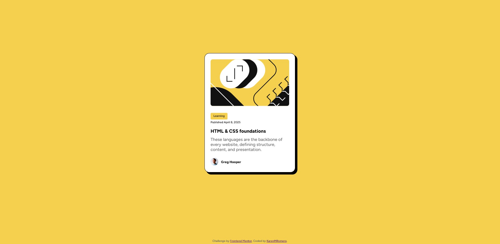
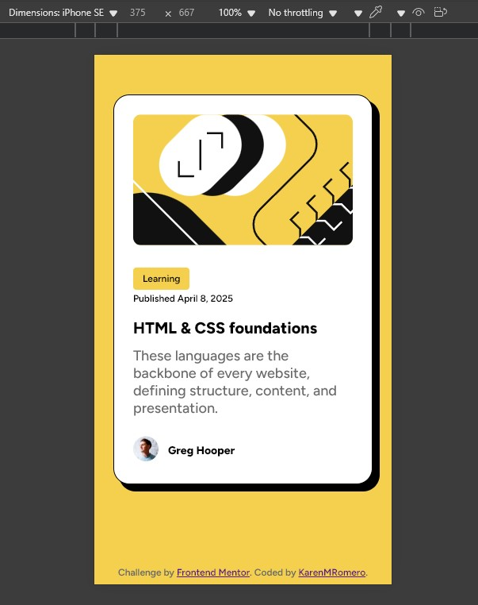

# Frontend Mentor - Blog preview card solution

This is my solution to the [Blog preview card challenge on Frontend Mentor](https://www.frontendmentor.io/challenges/blog-preview-card-ckPaj01IcS). This challenge helped me practice building responsive components and improving accessibility using semantic HTML and CSS.

## Table of contents

- [Overview](#overview)
  - [The challenge](#the-challenge)
  - [Screenshot](#screenshot)
  - [Links](#links)
- [My process](#my-process)
  - [Built with](#built-with)
  - [What I learned](#what-i-learned)
- [Author](#author)

## Overview

### The challenge

Users should be able to:

- See hover and focus states for all interactive elements
- View a fully responsive layout on different screen sizes (without media queries)
- Navigate a visually accessible component that meets WCAG AAA color contrast standards

### Screenshot




### Links

- Solution URL: [https://www.frontendmentor.io/solutions/your-solution-link](https://www.frontendmentor.io/solutions/your-solution-link)
- Live Site URL: [https://yourusername.github.io/project-name](https://yourusername.github.io/project-name)

## Author

- Frontend Mentor - [@yourusername](https://www.frontendmentor.io/profile/yourusername)
- Twitter - [@yourusername](https://twitter.com/yourusername)

## My process

### Built with

- Semantic HTML5
- CSS (custom properties and utility classes)
- Flexbox
- Mobile-first workflow
- Google Fonts (Figtree)

### What I learned

While working on this project, I focused on accessibility and visual clarity. Some of the improvements I implemented include:

- **Ensured border-radius consistency** by applying it to both the `img-container` and the image itself.
- **Improved color contrast** to meet **WCAG AAA** standards by adjusting font size and maintaining strong color contrast.
- **Removed media queries**: Made the component responsive by relying on relative units and flexible container sizing (`max-width: calc(100% - 3rem)`).
- Added clear **hover styles** that enhance user experience while maintaining accessibility.

```css
.card {
  box-shadow: .5rem .5rem 0rem .0625rem black;
  transition: box-shadow 0.2s ease, color 0.2s ease;
}
.card:hover .title {
  color: #f4d04e;
}

